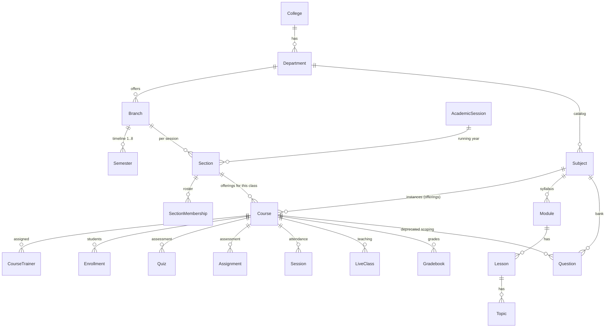

# College-Accurate Schema — Design Doc

**Status:** Stages 1–5 implemented and deployed (Aug 2026). Stage 2 ships real `Subject`, `Section`, `AcademicSession` tables, offering-based course creation, section rosters with auto-enrollment, and section-based promotion. **Stage 3 (read-path switch) is done:** courses resolve their Subject in every list/detail API, modules read the Subject-level syllabus with offering fallback, the question bank is subject-owned (`Question.subject_id`, backfilled live — 29 questions linked), and the question-bank UI is subject-first. **Stages 4–5 (write path + UI) complete:** subject-owned syllabus editor on the Subjects page (`GET /subjects/:id/syllabus` + module create with `subject_id`), the offering builder links new modules to the subject, section-to-section **Promote** on the Sections page, and the Semesters page shows the per-branch timeline with semester numbers. Multi-college targeting for super-admin events/forums/chat rooms is live (`target_tenants`, with `__ALL__` broadcast). **Phase 6 (destructive column drop) intentionally deferred** — requires ≥ 1 verified academic cycle; the readiness gate is `infrastructure/db/parity_audit.sql`.
**Scope:** `course-service`, `college-service`, `assessment-service` schemas + admin UI
**Author:** SannaLMS engineering
**Related docs:** `docs/ARCHITECTURE.md`, `docs/RBAC_ADMIN_ACCESS_MATRIX.md`

---

## 1. TL;DR

Our current `Course` table is a single flat thing trying to be a *subject*, an *offering*,
and a *class roster* at the same time. Real colleges separate these concepts:

| Real-world concept | Our current model | Target model |
|---|---|---|
| "Data Structures" (a subject with a code & credits) | a `Course` row | **`Subject`** (catalog) |
| "Data Structures taught to CSE Sem-3 Section A, 2026-27, by Prof. Rao" | same `Course` row | **`CourseOffering`** (instance of a subject) |
| "CSE 2nd year, Sem 3, Section A, 2026-27 batch" | `Branch` + flat `Semester` (no batch, no section) | **`Section`** (a cohort) |
| "2026-27 academic year" | doesn't exist | **`AcademicSession`** |
| "This subject is worth 4 credits" | doesn't exist | **`credits`** on `Subject` |

**Key pragmatic decision:** we keep the `Course` table (renamed *conceptually* to
`CourseOffering`) and add a `subject_id` foreign key to it. That way every downstream
table that already references `course_id` — `Question`, `Quiz`, `Assignment`,
`Gradebook`, attendance `Session`, `LiveClass`, `Enrollment`, `CourseTrainer` —
keeps working unchanged. We never have to rewrite foreign keys across six services.

The migration is **additive** for phases 1–5 (new tables + nullable columns + backfill)
and only destructive in the final cleanup phase after a full academic cycle is verified.

---

## 2. Problem Statement

### 2.1 Evidence from the current schema

Current `Course` (`course-service/prisma/schema.prisma`):

```prisma
model Course {
  id            String   @id @default(uuid())
  title         String
  description   String?
  status        CourseStatus @default(DRAFT)
  department_id String?
  branch_id     String?
  semester_id   String?
  year          String?      // <-- ambiguous: calendar year OR year of study?
  ...
}
```

Concrete gaps, each observed in the live system:

1. **No catalog/offering split.** "Python 101" is one row. If two branches, two batches,
   or two sections teach it, there is no way to represent that — you'd create duplicate
   rows with the same title and no way to tell them apart. This produced the real bug
   where every course in a college showed `—` for dept/branch/semester (the create form
   made targeting optional because the model has no natural place for an *instance*).

2. **No section (class).** Real colleges split "B.Tech CSE Sem 3" into Section A and B,
   each with its own trainer, timetable, and roster. We can't model that: one `Course`
   row per subject means Section A and B must share trainers and students.

3. **No academic session.** "2026-27 Sem 1" and "2027-28 Sem 1" are both just
   "Semester 1" rows in the same flat `Semester` table, so they collide. This is
   exactly the "Semester 1–8 repeated many times" duplication seen in the UI — it's not
   a display bug, it's the model.

4. **Year is ambiguous.** `year` is a free-form `String`. The CSV import and grade card
   use it as *year of study* (1/2/3/4) while `CreateCourseModal` offered *calendar years*
   (2026/2027/2028). A real college tracks **both**: admission-batch year and year of study.

5. **No credits.** No field anywhere for subject credits, L-T-P structure, or subject code
   (CS201, EC301) — the basics of any transcript.

6. **Syllabus is duplicated per offering.** `Module → Lesson → Topic` hangs off
   `Course`. Teaching "Data Structures" to two sections means duplicating the whole
   module tree. In reality the *subject* owns the syllabus once.

7. **Question bank is scoped to an offering, not a subject.** `Question.course_id`
   means the same subject's question bank can't be reused across sections/batches —
   contradicting the requirement "for different courses we need different question banks"
   (a bank belongs to the *subject*).

8. **Promotion is semester-to-semester, not cohort-to-cohort.** `Promotion` moves
   `student_id` from `from_semester_id` to `to_semester_id` but has no notion of the
   section, batch, or session being promoted.

### 2.2 What real colleges do (researched)

From the academic-structure models used by actual education platforms (Classe365,
PeopleSoft Campus Solutions, Salesforce Education Cloud) and the way Indian universities
organize:

```
University
 └── College
      └── Department (School of Engineering)
           └── Program / Branch (B.Tech CSE)          ← multi-year degree track
                └── Academic Session (2026-27)        ← the running year
                     └── Section (CSE-A, Sem 3, 2nd yr, 2025 batch)   ← the roster unit
                          ├── Subject "Data Structures" (CS201, 4 credits)  ← catalog
                          │    └── Course Offering: taught by Prof. Rao to CSE-A
                          │         └── enrollments, grades, quizzes, attendance sessions
                          └── Subject "Discrete Math" (CS203, 3 credits)
                               └── Course Offering: taught by Prof. Rao to CSE-A
```

Two distinctions are non-negotiable:

- **Catalog vs. offering.** A *subject* is defined once (code, credits, syllabus).
  An *offering* is the subject being taught to a specific cohort in a specific session.
- **Enroll in the class, not in each subject.** Students are admitted to a *section*;
  they are automatically enrolled in every core offering that section runs. Electives are
  the exception (manual per-offering enrollment).

---

## 3. Target Data Model

### 3.1 New entities

#### `Subject` — the catalog definition (course-service)

```prisma
model Subject {
  id            String   @id @default(uuid())
  tenant_id     String
  code          String            // "CS201" — auto-generated if blank, unique per branch
  name          String            // "Data Structures"
  description   String?
  department_id String?           // offering school (logical ref to college-service)
  branch_id     String?           // program this subject belongs to (logical ref)
  credits       Int      @default(3)   // 1..12
  lt_p          String?           // "3-1-0" lecture-tutorial-practical
  status        CourseStatus @default(DRAFT)  // DRAFT | PUBLISHED | ARCHIVED
  version       Int      @default(1)
  created_at    DateTime @default(now())
  updated_at    DateTime @updatedAt
  deleted_at    DateTime?
  created_by    String?
  updated_by    String?
  deleted_by    String?

  modules        Module[]          // syllabus moves here (see 3.3)
  offerings      Course[]          // CourseOffering instances
  questions      Question[]        // logical: subject question bank (assessment-service)

  @@unique([tenant_id, branch_id, code])
  @@index([tenant_id, department_id])
}
```

#### `AcademicSession` — the running academic year (college-service)

```prisma
enum AcademicSessionStatus {
  PLANNED
  ACTIVE      // exactly one per tenant at a time
  CLOSED
}

model AcademicSession {
  id          String   @id @default(uuid())
  tenant_id   String
  name        String                 // "2026-27"
  start_date  DateTime?
  end_date    DateTime?
  status      AcademicSessionStatus @default(PLANNED)
  is_current  Boolean  @default(false)
  version     Int      @default(1)
  created_at  DateTime @default(now())
  updated_at  DateTime @updatedAt
  deleted_at  DateTime?
  created_by  String?
  updated_by  String?
  deleted_by  String?

  sections Section[]

  @@unique([tenant_id, name])
}
```

#### `Section` — a concrete cohort (college-service)

The atomic roster unit. Replaces the ambiguity of the flat `Semester` list.

```prisma
model Section {
  id                 String   @id @default(uuid())
  tenant_id          String
  branch_id          String            // program (logical ref)
  academic_session_id String           // which running year
  year_of_study      Int               // 1..4 (or 1..3 for a 3-year program)
  semester_number    Int               // 1..8 — Sem 3 ⇒ 2nd year, 1st semester of that year
  name               String  @default("")   // "A", "B", "C" — "" means the class is unsplit
  version            Int      @default(1)
  created_at         DateTime @default(now())
  updated_at         DateTime @updatedAt
  deleted_at         DateTime?
  created_by         String?
  updated_by         String?
  deleted_by         String?

  offerings          Course[]           // logical: offerings running for this section
  memberships        SectionMembership[] // logical: the roster

  @@unique([tenant_id, branch_id, academic_session_id, semester_number, name])
  @@index([tenant_id, academic_session_id])
  @@index([branch_id, semester_number])
}
```

Display name is derived: `B.Tech CSE · 2026-27 · Sem 3 · A` (or `... · Sem 3` when `name = ""`).

#### `SectionMembership` — the class roster (course-service)

```prisma
enum MembershipStatus {
  ACTIVE
  COMPLETED   // promoted / graduated out of this section
  DROPPED
}

model SectionMembership {
  id           String   @id @default(uuid())
  tenant_id    String
  section_id   String              // logical ref to college-service
  user_id      String              // student (logical ref to college-service)
  status       MembershipStatus @default(ACTIVE)
  enrolled_at  DateTime @default(now())
  version      Int      @default(1)
  created_at   DateTime @default(now())
  updated_at   DateTime @updatedAt
  deleted_at   DateTime?
  created_by   String?
  updated_by   String?
  deleted_by   String?

  @@unique([section_id, user_id])
  @@index([user_id, status])
}
```

#### `CourseOffering` — the `Course` table, re-scoped (course-service)

No table rename (avoids touching every FK). Additive columns:

```prisma
model Course {                       // NOW: a CourseOffering
  id            String   @id @default(uuid())
  title         String              // display title; defaults to subject.name
  description   String?
  status        CourseStatus @default(DRAFT)

  // NEW: catalog + cohort pointers (the offering identity)
  subject_id    String?             // which Subject (logical ref)
  section_id    String?             // which Section/cohort (logical ref)
  academic_session_id String?        // denormalized convenience (from section)
  year_of_study Int?                // denormalized (from section)
  semester_number Int?              // denormalized (from section)
  credits       Int?                // override; null ⇒ inherit from subject

  // DEPRECATED (kept for one release, then dropped): org targeting + ambiguous year
  department_id String?
  branch_id     String?
  semester_id   String?
  year          String?

  ... existing relations unchanged (modules, trainers, enrollments, history, resources)
  @@index([subject_id, section_id])
}

// Partial unique index — one offering per subject per section, unless deleted.
// CREATE UNIQUE INDEX offering_unique ON "Course" (subject_id, section_id)
//   WHERE subject_id IS NOT NULL AND section_id IS NOT NULL AND deleted_at IS NULL;
```

Rules:
- **Offerings inherit the syllabus** from `subject_id` (modules/lessons/topics move to the
  subject, §3.3). A trainer may add offering-specific resources via the existing
  `CourseResource` table without touching the shared syllabus.
- **Trainers attach at offering level** (`CourseTrainer` stays exactly as-is) — Section A
  and Section B of the same subject get different trainers via two offering rows.
- **Enrollment semantics change:** enroll in the *section* (SectionMembership) ⇒
  auto-enroll in every active offering of that section. Manual elective enrollment still
  works on the offering directly.

### 3.2 Changes to existing tables

| Table | Service | Change |
|---|---|---|
| `Semester` | college-service | add `semester_number Int?` (backfilled); the table remains the **program timeline template** (Branch → Sem 1..8), while actual running classes are `Section`s |
| `Module` | course-service | add `subject_id String?` (syllabus now subject-owned); keep `course_id` for one release |
| `Enrollment` | course-service | add `auto_enrolled Boolean @default(false)` + `section_id String?` (denormalized); keep `@@unique([user_id, course_id])` |
| `Promotion` | course-service | add `from_section_id String?`, `to_section_id String?` (cohort-based promotion); keep semester columns for the audit trail |
| `Question` | assessment-service | add `subject_id String?` (the bank is per-subject, reusable across offerings); keep `course_id` for one release |

### 3.3 Syllabus ownership moves to the subject

```prisma
model Module {
  id         String @id @default(uuid())
  title      String
  course_id  String?   // DEPRECATED after migration (offering-specific override only)
  subject_id String?   // NEW: primary owner of the syllabus
  ...
}
```

Read path: `offering.syllabus = modules.where(subject_id == offering.subject_id)`,
falling back to `course_id` for pre-migration rows. This removes the biggest source of
duplication (the same 6-module tree copied per section) and matches how a real college
maintains one syllabus per subject.

### 3.4 Entity-relationship overview



### 3.5 Service ownership

| Entity | Owning service | Notes |
|---|---|---|
| `College`, `Department`, `Branch`, `Semester` | college-service | unchanged |
| `AcademicSession`, `Section` | college-service | org/academic calendar |
| `Subject` | course-service | academic content (owns syllabus) |
| `Course` (offering) | course-service | unchanged table |
| `SectionMembership`, `Enrollment`, `Promotion` | course-service | rosters & records |
| `Question`, `Quiz`, `Assignment`, `Gradebook` | assessment-service | keep `course_id`; add `subject_id` on Question |
| `Session`, `LiveClass` | attendance / liveclass | unchanged |

Cross-service references (e.g. `Subject.subject_id` from `Question` in another service's
DB) are **logical** — plain UUID columns with app-level validation, exactly like the
existing `user_id` references. No DB foreign keys across service databases.

---

## 4. API Changes

New endpoints (all tenant-scoped, role-guarded):

| Method & path | Service | Purpose |
|---|---|---|
| `POST/GET/PUT/DELETE /api/v1/subjects` | course-service | catalog CRUD; `POST` takes `{name, code?, department_id?, branch_id?, credits, lt_p?}`; code auto-generated as `SUB-###` if blank |
| `POST /subjects/:id/duplicate` | course-service | clone a subject for a new branch (new code) |
| `GET /subjects/:id/syllabus` | course-service | module tree (moved builder reads here) |
| `POST/GET/PUT /api/v1/academic-sessions` | college-service | session CRUD; activating one sets `is_current` (exactly one ACTIVE) |
| `POST/GET/PUT/DELETE /api/v1/sections` | college-service | section CRUD, filtered by branch + session |
| `POST /sections/:id/members` · `DELETE /sections/:id/members/:userId` | course-service | roster management — enrolling a student in a section auto-enrolls them in all active offerings (`auto_enrolled=true`) |
| `POST /api/v1/enrollments/bulk` (extended) | course-service | add `section_id` mode: "enroll these students into this section" (replaces per-course loops) |
| `POST /api/v1/promotions` (extended) | course-service | accept `from_section_id`/`to_section_id`; moves memberships + auto-enrolls into the next section's offerings |

Behavioral changes to existing endpoints:

- `POST /courses` now requires `subject_id` + `section_id` (college admin flow becomes
  "pick subject → pick section → (optional) title/credits override → assign trainers").
  `department_id/branch_id/semester_id/year` become read-only derived fields.
- `GET /questions` adds a `subject_id` filter; the question-bank UI is subject-first.
- `GET /courses` (student view) unchanged — still enrollment-scoped — but enrollments now
  come from section membership (auto) + electives (manual).

---

## 5. Migration Plan

### Phase 0 — Preflight (30 min, staging + prod)

1. `pg_dump` all six service databases; store off-server.
2. Record current row counts: `Course`, `Enrollment`, `Module`, `Question`, `Promotion`,
   `Semester`, per tenant.
3. Freeze writes during the backfill window (or run against a staging copy first).
4. Run backfills directly on the DB host — **not** through the Kong gateway (60s timeout
   kills long batch jobs).

### Phase 1 — Additive schema (no data movement)

One Prisma migration per service, applied with the same manual process already used in
this repo (migration SQL applied via `psql`, then `prisma migrate deploy` in CI once
verified):

**Migration A — college-service** (`20260812_academic_session_section`):
```sql
ALTER TABLE "Semester" ADD COLUMN "semester_number" INTEGER;

CREATE TABLE "AcademicSession" (
  id UUID PRIMARY KEY DEFAULT gen_random_uuid(),
  tenant_id TEXT NOT NULL,
  name TEXT NOT NULL,
  start_date TIMESTAMPTZ, end_date TIMESTAMPTZ,
  status TEXT NOT NULL DEFAULT 'PLANNED',
  is_current BOOLEAN NOT NULL DEFAULT false,
  version INTEGER NOT NULL DEFAULT 1,
  created_at TIMESTAMPTZ NOT NULL DEFAULT now(),
  updated_at TIMESTAMPTZ NOT NULL DEFAULT now(),
  deleted_at TIMESTAMPTZ,
  created_by TEXT, updated_by TEXT, deleted_by TEXT,
  UNIQUE (tenant_id, name)
);

CREATE TABLE "Section" (
  id UUID PRIMARY KEY DEFAULT gen_random_uuid(),
  tenant_id TEXT NOT NULL,
  branch_id TEXT NOT NULL,
  academic_session_id TEXT NOT NULL,
  year_of_study INTEGER NOT NULL,
  semester_number INTEGER NOT NULL,
  name TEXT NOT NULL DEFAULT '',
  version INTEGER NOT NULL DEFAULT 1,
  created_at TIMESTAMPTZ NOT NULL DEFAULT now(),
  updated_at TIMESTAMPTZ NOT NULL DEFAULT now(),
  deleted_at TIMESTAMPTZ,
  created_by TEXT, updated_by TEXT, deleted_by TEXT,
  UNIQUE (tenant_id, branch_id, academic_session_id, semester_number, name)
);
CREATE INDEX idx_section_branch_sem ON "Section" (branch_id, semester_number);
```

**Migration B — course-service** (`20260812_subject_offering`):
```sql
CREATE TABLE "Subject" (
  id UUID PRIMARY KEY DEFAULT gen_random_uuid(),
  tenant_id TEXT NOT NULL,
  code TEXT NOT NULL,
  name TEXT NOT NULL,
  description TEXT,
  department_id TEXT, branch_id TEXT,
  credits INTEGER NOT NULL DEFAULT 3,
  lt_p TEXT,
  status TEXT NOT NULL DEFAULT 'DRAFT',
  version INTEGER NOT NULL DEFAULT 1,
  created_at TIMESTAMPTZ NOT NULL DEFAULT now(),
  updated_at TIMESTAMPTZ NOT NULL DEFAULT now(),
  deleted_at TIMESTAMPTZ,
  created_by TEXT, updated_by TEXT, deleted_by TEXT,
  UNIQUE (tenant_id, branch_id, code)
);
CREATE INDEX idx_subject_tenant_dept ON "Subject" (tenant_id, department_id);

ALTER TABLE "Course" ADD COLUMN "subject_id" TEXT,
                     ADD COLUMN "section_id" TEXT,
                     ADD COLUMN "academic_session_id" TEXT,
                     ADD COLUMN "year_of_study" INTEGER,
                     ADD COLUMN "semester_number" INTEGER,
                     ADD COLUMN "credits" INTEGER;
CREATE INDEX idx_course_subject ON "Course" (subject_id);
CREATE INDEX idx_course_section  ON "Course" (section_id);
CREATE UNIQUE INDEX offering_unique ON "Course" (subject_id, section_id)
  WHERE subject_id IS NOT NULL AND section_id IS NOT NULL AND deleted_at IS NULL;

ALTER TABLE "Module" ADD COLUMN "subject_id" TEXT;
CREATE INDEX idx_module_subject ON "Module" (subject_id);

ALTER TABLE "Enrollment" ADD COLUMN "auto_enrolled" BOOLEAN NOT NULL DEFAULT false,
                         ADD COLUMN "section_id" TEXT;
CREATE INDEX idx_enrollment_section ON "Enrollment" (section_id);

CREATE TABLE "SectionMembership" (
  id UUID PRIMARY KEY DEFAULT gen_random_uuid(),
  tenant_id TEXT NOT NULL,
  section_id TEXT NOT NULL,
  user_id TEXT NOT NULL,
  status TEXT NOT NULL DEFAULT 'ACTIVE',
  enrolled_at TIMESTAMPTZ NOT NULL DEFAULT now(),
  version INTEGER NOT NULL DEFAULT 1,
  created_at TIMESTAMPTZ NOT NULL DEFAULT now(),
  updated_at TIMESTAMPTZ NOT NULL DEFAULT now(),
  deleted_at TIMESTAMPTZ,
  created_by TEXT, updated_by TEXT, deleted_by TEXT,
  UNIQUE (section_id, user_id)
);
CREATE INDEX idx_membership_user ON "SectionMembership" (user_id, status);

ALTER TABLE "Promotion" ADD COLUMN "from_section_id" TEXT,
                        ADD COLUMN "to_section_id" TEXT;
```

**Migration C — assessment-service** (`20260812_question_subject`):
```sql
ALTER TABLE "Question" ADD COLUMN "subject_id" TEXT;
CREATE INDEX idx_question_subject ON "Question" (subject_id);
```

### Phase 2 — Backfill (one-off scripts, batched, idempotent)

Each backfill is a small Node/Python script run against the service DBs, wrapped in
transactions per tenant, logging a per-tenant summary.

**B2.1 Academic sessions** — for each tenant with courses: create `2026-27` with
`status=ACTIVE, is_current=true` if none exists.

**B2.2 Semester numbers** — parse `Semester.name` with
`/^\s*semester\s+(\d+)/i`; fallback: ordinal position in the branch's ordered list.
Rows that fail both are reported for manual review (do not guess).

**B2.3 Subjects** — dedupe key `(tenant_id, branch_id, lower(trim(title)))`:
- For each distinct title/branch group of courses, create one `Subject`
  (`code` = `CS###`-style auto-generated or parsed from the title if it looks like a
  code, e.g. "CS201 Data Structures").
- Set `Course.subject_id` for every course in the group.
- Emit a **collision report** (same title across branches — likely distinct subjects
  with different codes) for human decision; do not merge automatically.

**B2.4 Sections** — for each distinct `(tenant, branch, semester)` that has courses:
- Resolve `year_of_study = ceil(semester_number / 2)`, `semester_number` from B2.2.
- Create/reuse `Section { branch, session: tenant's active session, year, sem, name: "" }`.
- Set `Course.section_id` + denormalized `academic_session_id / year_of_study /
  semester_number` on each course.
- Report any course whose semester failed B2.2 (left `section_id` null — visible in the
  UI as "unassigned" so it's not silently lost).

**B2.5 Module syllabus** — `Module.subject_id = Course.subject_id` via join on
`course_id`. Keep `course_id` (fallback read path).

**B2.6 Question bank** — `Question.subject_id = Course.subject_id` via join on
`course_id`. Questions with null course are left null (flagged).

**B2.7 Rosters** — build `SectionMembership` from distinct `(user, section)` pairs across
`Enrollment` (via `course.section_id`). Mark those `Enrollment.auto_enrolled=true`.
Students enrolled in courses across *different* sections are reported (likely transfer or
elective cases — manual review).

**B2.8 Promotions** — resolve each existing `Promotion.from_semester_id →
to_semester_id` to sections (same branch, same session, sem numbers N and N+1); set
`from_section_id / to_section_id`.

**B2.9 Verification gate** — a report script asserts:
- every non-deleted `Course` has `subject_id` and `section_id` (0 unassigned) — or a
  reviewed exception list;
- `Enrollment` count unchanged; no dupes on `@@unique([user_id, course_id])`;
- `Module`/`Question` subject backfill ≥ 98% (the rest are flagged, not dropped);
- sample queries for the new read paths return the same data as the old paths.

### Phase 3 — Read-path switch (code, per service)

- `CoursesService.findAll/findOne`: unchanged filters; responses now include the
  resolved `subject` and `section` display names (replaces the `—` in the
  Dept/Branch/Sem/Year column).
- Syllabus reads: `modules.where(subject_id = offering.subject_id)` with `course_id`
  fallback.
- Question-bank reads: subject-first filters.
- Grade card: aggregate by `(section_id, academic_session_id)` for CGPA.

### Phase 4 — Write-path switch (new APIs in §4)

Ship new endpoints behind the same controllers. Old create-course payloads keep working
(deprecated fields mapped into subject/section resolution) for one release.

### Phase 5 — UI changes (admin-ui + student portal)

1. **Subjects page** (new): catalog grid with code/credits/status; the course builder
   (modules/lessons/topics) moves here — "edit syllabus" is now per-subject.
2. **Academic Sessions page** (new): create/activate/close sessions; one ACTIVE per
   college.
3. **Sections page** (new): pick branch → session → list of sections with rosters,
   "Enroll students", "Split into sections" (adds A/B/C), and the **Promote** action
   becomes section-to-section.
4. **Courses page** → "Offerings": create flow becomes *select subject → select section →
   optional title/credits override → assign trainers*. The calendar-year dropdown is
   replaced by session + year-of-study + semester selectors.
5. **Question Bank**: subject picker first, then dept/branch/semester as filters.
6. **Semesters page**: shows the program timeline per branch (Sem 1–8 once per branch,
   with semester numbers) plus a note that running classes live under Sections.
7. **Student portal**: "My Classes" (sections) with subjects inside; grade card shows
   session + CGPA.

### Phase 6 — Deprecation & cleanup (after ≥ 1 verified academic cycle)

- Keep deprecated columns (`Course.department_id/branch_id/semester_id/year`,
  `Question.course_id`, `Module.course_id`) and run parity audit queries each release.
- When audit is clean and no read path uses them, ship one destructive migration to drop
  them. **This is the only irreversible step** — requires explicit sign-off + fresh backup.

---

## 6. Rollback & Risk Register

| Risk | Mitigation |
|---|---|
| Subject title collisions across branches (same name, different programs) | Dedupe is per `(tenant, branch)`; collision report requires manual decision; no auto-merge |
| Ambiguous semester names fail parsing | B2.2 fallback + explicit "unassigned" flag, never guessed |
| Enrollment duplication during roster build | `@@unique` constraints + upsert; B2.9 count gate |
| Backfill volume (thousands of students) | Batched transactions per tenant, run on DB host, indexes created in Phase 1 before backfill |
| Cross-service logical FKs drift | Same pattern as existing `user_id` references; documented in §3.5; app-level validation |
| Kong gateway 60s timeout on long jobs | Backfills never go through the gateway; new bulk endpoints respond immediately and process async |
| Phase 6 data loss | Only reversible step; requires backup + sign-off; all earlier phases are additive and roll back by reverting read paths |

**Rollback of phases 1–5:** the old read paths still work (deprecated columns intact), so
rolling back = deploy the previous code, zero data restoration needed. Restore from dump
only if Phase 6 cleanup already ran.

---

## 7. Open Questions (need product sign-off)

1. **Section split timing** — ship with a single default section (`name = ""`) per
   class and let colleges split into A/B/C later? (Recommended: yes — keeps onboarding
   simple and the schema already supports splitting.)
2. **Subject dedupe policy** — one subject per branch (recommended) vs. one per
   department shared across branches (rare for Indian universities, where codes are
   program-specific).
3. **Elective handling** — electives are manual per-offering enrollments
   (`auto_enrolled=false`) and are excluded from section auto-enrollment. Confirm this is
   sufficient for the first release.
4. **Session naming** — auto-generate from admission batch ("2026-27") or free text?
   (Recommended: auto-generate, allow override.)
5. **Trainer assignment level** — offering level (per section) confirmed? TA assignment
   to multiple sections of the same subject should be allowed (two `CourseTrainer` rows).
6. **Transcript scope** — grade card shows per-session aggregates and cumulative CGPA;
   confirm the certificate service should print session + subject code + credits.

---

## 8. Suggested Implementation Order

1. Phase 0–2 on a staging copy of the live DB (verifies backfill rules against *real*
   data — Test College + any retained colleges).
2. Ship Phases 3–5 behind a feature flag; college admin sees the new flow; old flow
   remains for one release.
3. Manual test with Green Valley University (the test kit in `test-data/greenvalley/`),
   including the Promote flow and the grade card.
4. Phase 6 after one full cycle of verified promotions.
